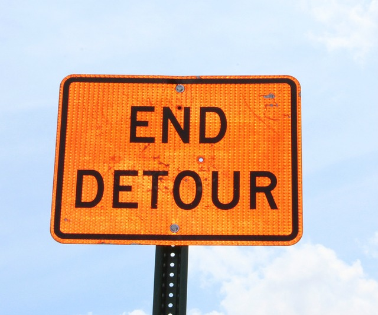
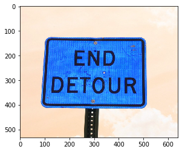
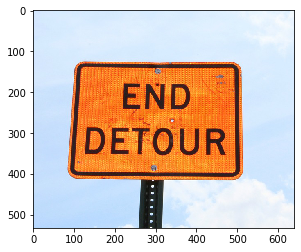
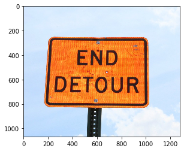
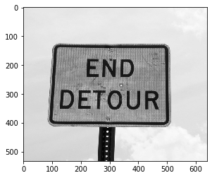
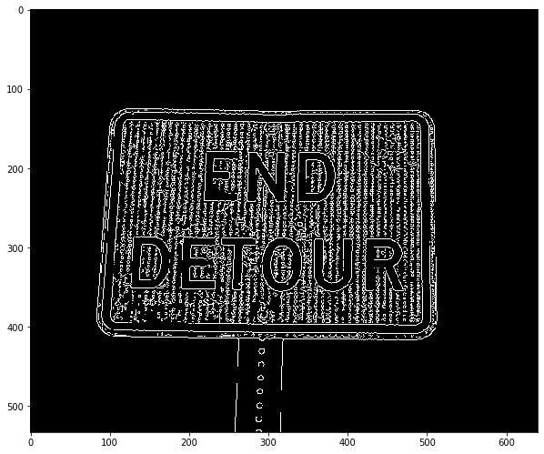
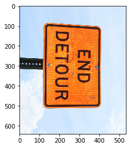
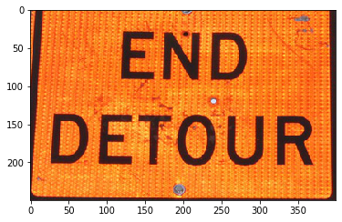

 

# Basic Image Operations in OpenCV and Python Image Library
### Dependencies

* **Anaconda**
* **OpenCV**

```
conda install -c menpo opencv
#test by "import cv2"
```


```python
import cv2
from PIL import Image
import matplotlib.pyplot as plt
```

### cv2.imread, cv2.imshow 
read and show image



```python
img = cv2.imread("assets/end-detour.jpg")
plt.imshow(img) #Notice BGR color
#cv2.imshow("Image", img)
#cv2.waitKey(0)
#This launches the image window 
#cv2.destroyAllWindows()
```


    <matplotlib.image.AxesImage at 0x1c03f644c48>





```python
### Convert to RGB coolor to displat in Matplotlib
```


```python
img = cv2.imread("assets/end-detour.jpg", 1) #1 for color image
img2 = cv2.cvtColor(img, cv2.COLOR_BGR2RGB) #Converts from one colour space to the other
plt.imshow(img2)
```


    <matplotlib.image.AxesImage at 0x1c03f70bf08>





### cv2.resize


```python
img = cv2.imread("assets/end-detour.jpg")
print(img.shape)

scale =2 #times or 200%
width = int(img.shape[1] * scale)
height = int(img.shape[0] * scale)
print(width, height)
resized_img = cv2.resize(img, (width, height), interpolation = cv2.INTER_AREA)

rgbimg = cv2.cvtColor(resized_img, cv2.COLOR_BGR2RGB)
plt.imshow(rgbimg)
#see pixel size in plt tickers
```

    (533, 640, 3)
    1280 1066
    


    <matplotlib.image.AxesImage at 0x1c03f781d88>





### PIL.open, PIL.show


```python
pil_image= Image.open(r"assets/end-detour.jpg")
#watch image window
```


```python
pil_img= Image.open(r"assets/end-detour.jpg")
plt.imshow(pil_img)
```


    <matplotlib.image.AxesImage at 0x1c04045cc08>


### cv2.cvtColor
convert color space


```python
img = cv2.imread("assets/end-detour.jpg")
print(img.shape)
#convert to grayscale
grayimg = cv2.cvtColor(img, cv2.COLOR_BGR2GRAY)
plt.imshow(grayimg, cmap="gray") #otherwise, plt would add a default color map to 2d gray image
```

    (533, 640, 3)
    


    <matplotlib.image.AxesImage at 0x1c0415f0a88>





### PIL.convert 
for color convert. See converting to gray below


```python
img= Image.open("assets/end-detour.jpg")
grayimg=img.convert('L') # Lmode for Gray and RGB for color in PIL
grayimg.show()
```

### cv2.Canny Edge Detection
color> threashold1 is edge  
color < threshold2 is non-edge  
colors between threshold1 and threshold2 are removed  


```python
image= cv2.imread("assets/end-detour.jpg",0)
#cv2.namedWindow("Canny", cv2.WINDOW_NORMAL)
cannyimg = cv2.Canny(image, 100,200 )
#cv2.imshow("Canny Img", cannyimg)
#cv2.waitKey(0)
#cv2.destroyAllWindows()

plt.figure(figsize=(10,10))
plt.imshow(cannyimg, cmap="gray")
```


    <matplotlib.image.AxesImage at 0x2290ceabd48>





### cvs.rotate
- cv2.ROTATE_90_CLOCKWISE,
- cv2. ROTATE_90_COUNTERCLOCKWISE
- cv2.ROTATE_180


```python
#Rotating the image
image= cv2.imread("assets/end-detour.jpg",1)
rotated_img= cv2.rotate(image,cv2.ROTATE_90_CLOCKWISE )
rgbimg = cv2.cvtColor(rotated_img, cv2.COLOR_BGR2RGB)
plt.imshow(rgbimg)
```


    <matplotlib.image.AxesImage at 0x2290d0ccac8>





### cv2.crop


```python
image= cv2.imread("assets/end-detour.jpg",1)
cropped=image[150:400, 100:500] #y1:y2(height), x1:x2(width)
#pilimage.crop(left,top,right,bottom)
rgbimg = cv2.cvtColor(cropped, cv2.COLOR_BGR2RGB)
plt.imshow(rgbimg)
```


    <matplotlib.image.AxesImage at 0x2290e3db288>





```python

```
